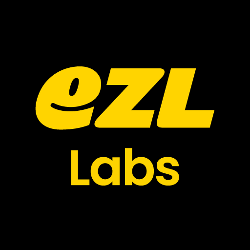

# 회사 소개

안녕하세요. 이즐랩스입니다. 

## 미션

> IT 제품과 서비스를 통해 이동의 즐거움을 고객에게 선사한다.

## 비전

> 이동의 즐거움과 고객 모두의 니즈를 충족시키기 위한 다양한 개발 전략을 수행할 수 있는 전문 개발사

## 핵심가치

> - 공학적 사고를 통한 문제 해결
> - 프로페셔널의 자세
> - 효과적인 커뮤니케이션
> - 팀 중심의 조직

# 인재 채용

## Software Engineer (Front-end, Jr)

### 채용 절차

1. 서류 접수
    > <job@ezllabs.co.kr>로 이력서 및 자신을 소개할 수 있는 자료들을 보내주세요. 
2. 온라인 코딩 테스트
3. 화상 기술 면접, 코딩 테스트 리뷰
4. 대면 면접

### 주요 업무

- 자사 서비스 웹/앱 서비스 프론트엔드 개발

### 기술스택

- Javascript, Typescript, React
- Recoil, React Query
- React Native (기본적인 이해)
- AWS, Jenkins, Fastlane
- git, github
- Figma
- Google Workspace
- Jira, Confluence

### 자격요건

- 컴퓨터 공학과 관련된 전공 졸업자(비 전공자일 경우 유관 프로젝트 경험자)
- HTML, CSS, ES6, React, TypeScript을 활용한 웹개발 경험
- Git과 같은 분산 버전 관리 툴의 기본적인 사용이 가능하신 분

### 우대사항

- 토이 프로젝트가 아닌 실제 사용목적을 가진 서비스 개발 경험
- 다른 사람들과 협업하여 프로젝트를 수행한 경험이 있으신 분
- 자동화 테스트 코드의 작성이 가능하신 분

## PM/기획 (연차 무관)

### 채용 절차

1. 서류 접수
    > <job@ezllabs.co.kr>로 이력서 및 자신을 소개할 수 있는 자료들을 보내주세요. 
2. 대표와 대면 면접
3. 실무진과 대면 면접

### 주요업무

- 프로젝트 및 일정 관리
- 서비스 플로우 기획, 화면 설계 및 정책 수립
- 사용자 관점 및 비지니스 관점의 이해를 통한 요구사항 분석
- 개발, 디자인, 사업 부서와의 협업 및 업무 리딩을 통한 서비스 및 플랫폼 개선

### 자격요건

- 적극적이고 능동적인 마인드를 소유하고 팀 및 프로젝트 리드 경험이 있으신 분
- 동시다발적으로 실행되는 여러 이니셔티브의 우선순위를 정하고 관리한 경험이 있으신 분
- 기획, 디자인, 개발 과정에서 효율적인 협업이 진행되도록 도울 수 있는 분
- 효과적인 커뮤니케이션 능력으로 논점에 대한 이해와 설득이 수월하신 분
- UX/UI를 포함한 앱/웹 환경에 대한 이해도를 지니신 분
- 프로덕트 디자인 프로세스/라이프사이클과 관련된 의사결정에 관여한 경험이 있으신 분
- MS Office, teams, Figma, Google Workspace, Jira, Confluence, slack 등의 협업 툴 사용이 가능하신 분

### 우대사항

- 디자인 시스템에 대한 이해가 있으신 분
- GA4 연동, 이벤트 설계 등에 대한 이해가 있으신 분
- AppsFlyer, Airbridge 등 MMP 연동 경험이 있는 분
- SAFe (Scaled Agile Framework)에 대한 이해

# 사내 복지

- 시차 출근제 운영 (8 ~ 10시 출근, 5 ~ 7시 퇴근)
- 2시간 단위 반반차 가능
- 야근 식대 지원
- 커피머신, 간식 제공
- 직무 관련 도서 구매, 컨퍼런스 참여, 강의 수강 지원
- 설, 추석 소정의 상여금
- 경조휴가 및 화환
